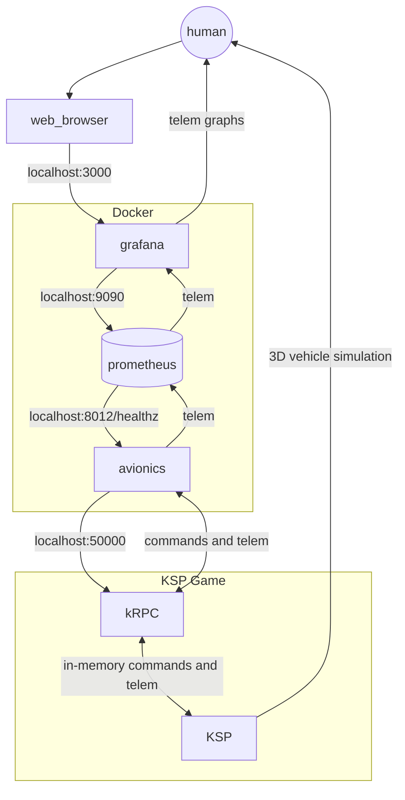

# KSP KRPC Rocket Avionics

## Running

This project uses `uv` for dependency management. To install the dependencies run `uv sync`. 
Dependencies will be stored in the .venv folder within this project. You can point your IDE to this venv for local runtime.
Alternatively you can run scripts using the `uv` command in a way which access the venv, e.g. `uv run maxerva1.py`

## Craft files

Check out https://kerbalx.com/I2ocketGuy/craft, especially:

- [Maxerva-1 Kerbalx](https://kerbalx.com/I2ocketGuy/Maxerva-I-Kerbalx)
- [Minerva-1 FR](https://kerbalx.com/I2ocketGuy/Minerva-I-FR)
- [Maxerva-I CEV FR](https://kerbalx.com/I2ocketGuy/Maxerva-I-CEV-FR)

## Live telem view

docker compose based orchestration available for launch with live telemetry graphs available.

`make launch_metrics_backend` will launch the metrics system backend systems: grafana for frontend and prometheus for timeseries DB.

`make launch_rocket` will run the default avionics package defined in the Makefile. This can be sent an avionics file paramaeter, for example to launch the `maxerva1.py` fsw, run `make avionics_file=maxerva1.py launch_rocket`

access the system via browser at localhost:3000

a network diagram of expected system interactions follows:

